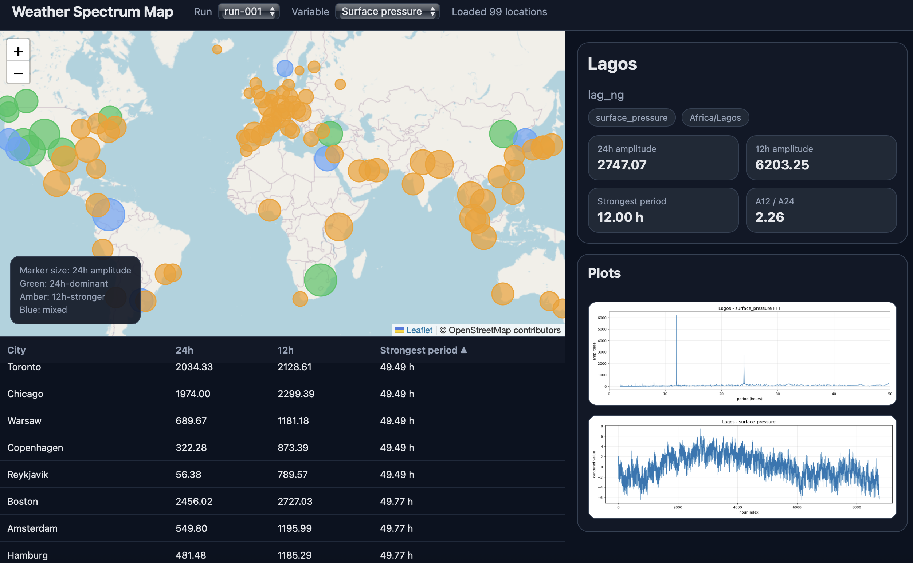

# 📦 Signal Searching

This is a demonstration of using Discrete Fourier Transform (DFT) on weather data obtained from the [Open Meteo] API. Details are described in [Signal Searching].

## 🌟 Highlights
Kubernetes implementation includes:
- A Deployment that uses a pvc to retain both the source data, and the analysis results in sqlite3 db.
- A Deployment that uses the db service to access the analysis results as well as expose a web interface to users.
- A Job that obtains weather data from the Open Meteo API for a configurable set of cities around the world and populates the db.
- A Job that performs the DFT for the weather data and updates the db with analysis results.
- A Job that summarizes the analysis results per location into a sortable, global set of data for visual representation.

## ℹ️ Overview

Please refer to [Signal Searching] for the specific blog and the relevant repo(s). If you don't have time TL;DR:

Analysis of een a 365-day worth of weather data across the world provide interesting insights. Primarily, the influence of semi-diurnal (12-hour period) and diurnal (24-hour period) surface pressure oscillations are easily recognizable for different geographies. This simple demo has provided patterns matching results reported by a 1999 paper from [NSF National Center for Atmospheric Research].  

### ✍️ Authors

All repos shared in [CurioCopia] are shared under Creative Commons license for others to adopt and use it as they wish.

## 🚀 Usage

1. Generate your own Docker image for [weather-spectrum], place it in your favorite registry.
2. Clone this repo, adjust the essential parameters in [demo], run kustomize to generate the resources.
3. Access the UI via browser and enjoy.



## ⬇️ Installation

Let's follow the typical Kustomize installation process.

Define a place to work:
```bash
TEST_HOME=$(mktemp -d)
```
### Establish the Base

```bash
BASE=$TEST_HOME/base
mkdir -p $BASE

CONTENT="https://raw.githubusercontent.com/Curiocopia/blog-signal-searching/refs/heads/main"

curl -s -o "$BASE/#1" "$CONTENT/base\
/{kustomization.yaml,weather-api-deployment.yaml,weather-db-service.yaml,weather-spectrum-config.env,locations.json,weather-api-service.yaml,weather-fetch-job.yaml,weather-spectrum-pvc.yaml,weather-analyze-job.yaml,weather-db-deployment.yaml,weather-reduce-job.yaml,weather-spectrum-run-window.env}"
```
Look at the directory:
```bash
tree $TEST_HOME
```
Expect something like:
```bash
/tmp/tmp.BryNxJxhiM
└── base
    ├── kustomization.yaml
    ├── locations.json
    ├── weather-analyze-job.yaml
    ├── weather-api-deployment.yaml
    ├── weather-api-service.yaml
    ├── weather-db-deployment.yaml
    ├── weather-db-service.yaml
    ├── weather-fetch-job.yaml
    ├── weather-reduce-job.yaml
    ├── weather-spectrum-config.env
    ├── weather-spectrum-pvc.yaml
    └── weather-spectrum-run-window.env

```
### The Base Customization

The base directory has a kustomization file:
```bash
more $BASE/kustomization.yaml
```
You can run kustomize on the base to emit customized resources to stdout and inspect:
```bash
kustomize build $BASE
```
Adjust the values of the kustomize output and split the resources into their own files and then execute them in the preferred order.

```bash
RESOURCES=$TEST_HOME/resources
mkdir -p $RESOURCES

kustomize build $BASE -o $RESOURCES
tree $TEST_HOME
/tmp/tmp.BryNxJxhiM
├── base
│   ├── kustomization.yaml
│   ├── locations.json
│   ├── weather-analyze-job.yaml
│   ├── weather-api-deployment.yaml
│   ├── weather-api-service.yaml
│   ├── weather-db-deployment.yaml
│   ├── weather-db-service.yaml
│   ├── weather-fetch-job.yaml
│   ├── weather-reduce-job.yaml
│   ├── weather-spectrum-config.env
│   ├── weather-spectrum-pvc.yaml
│   └── weather-spectrum-run-window.env
└── resources
    ├── apps_v1_deployment_weather-api.yaml
    ├── apps_v1_deployment_weather-db.yaml
    ├── batch_v1_job_weather-analyze.yaml
    ├── batch_v1_job_weather-fetch.yaml
    ├── batch_v1_job_weather-reduce.yaml
    ├── v1_configmap_weather-spectrum-config-kgt8ff684f.yaml
    ├── v1_configmap_weather-spectrum-locations-tmtmb9dck2.yaml
    ├── v1_configmap_weather-spectrum-run-window-fb2td5956g.yaml
    ├── v1_persistentvolumeclaim_weather-spectrum-pvc.yaml
    ├── v1_service_weather-api.yaml
    └── v1_service_weather-db.yaml

```
Follow the recipe below (adjust for your own exact filenames):
```bash
cd $RESOURCES

kubectl apply -f $RESOURCES/v1_persistentvolumeclaim_weather-spectrum-pvc.yaml
kubectl apply -f $RESOURCES/v1_configmap_weather-spectrum-config-kgt8ff684f.yaml
kubectl apply -f $RESOURCES/v1_configmap_weather-spectrum-locations-tmtmb9dck2.yaml
kubectl apply -f $RESOURCES/apps_v1_deployment_weather-db.yaml
kubectl apply -f $RESOURCES/v1_service_weather-db.yaml
kubectl apply -f $RESOURCES/apps_v1_deployment_weather-api.yaml
kubectl apply -f $RESOURCES/batch_v1_job_weather-fetch.yaml
```

Once the resources are running, follow the `weather-fetch` job status
```bash
kubectl get jobs -w 
```
```bash
$ kubectl get jobs -w
NAME              STATUS     COMPLETIONS   DURATION   AGE
weather-fetch     Complete   1/1           21s        45s
```
Once the job is completed, obtain the `WINDOW_START` and `WINDOW_END` values from the `weather-api`:
```bash
curl -s http://192.168.1.3:30080/runs | jq -rc '.[].window_start' 2>/dev/null
2025-04-01T05:00:00+00:00

curl -s http://192.168.1.3:30080/runs | jq -rc '.[].window_end' 2>/dev/null
2026-04-01T04:00:00+00:00
```
Use these values to patch the `weather-spectrum-run-window` configmap:
```bash
kubectl patch configmap weather-spectrum-run-window-fb2td5956g -p '{"data":{"WINDOW_START":"2025-04-01T05:00:00+00:00"}}'
configmap/weather-spectrum-run-window-fb2td5956g patched

kubectl patch configmap weather-spectrum-run-window-fb2td5956g -p '{"data":{"WINDOW_END":"2026-04-01T04:00:00+00:00"}}'
configmap/weather-spectrum-run-window-fb2td5956g patched
```
Run the `weather-analyze` Job and upon its termination `weather-reduce` Job:
```bash
kubectl apply -f $RESOURCES/batch_v1_job_weather-analyze.yaml
kubectl wait --for=condition=complete job/weather-analyze
kubectl apply -f $RESOURCES/batch_v1_job_weather-reduce.yaml
```
Once all the Jobs are complete, access the UI: http://<NODE-IP>:30080

## Create Overlay

Create a `demo` overlay.
```bash
OVERLAYS=$TEST_HOME/overlays
mkdir -p $OVERLAYS/demo
```
## Demo Customization

```bash
curl -s -o "$OVERLAYS/demo/#1" "$CONTENT/overlays/demo\
/{kustomization.yaml,weather-analyze-job-patch.yaml,weather-spectrum-config-demo.env,weather-spectrum-run-window-demo.env}"
```
Adjust the parameters as you need. Set `namespace` for all resources and `weather-spectrum` in `kustomization.yaml`:
```yaml
namespace: demo

images:
- name: YOUR_REGISTRY/weather-spectrum
  newName: my-registry/weather-spectrum
  newTag: latest
```
Adjust `weather-spectrum-config-demo.env` values for ConfigMap creation to use in various reources.

Adjust the values for the `spec.parallelism` and `spec.completion`  in the `weather-analyze-job-patch.yaml` to be identical to `WORKER_COUNT` set in `weather-spectrum-config-demo.env`.


Delete any previous values in the resources and create the new resource files by applying the kustomization.
```bash
rm $RESOURCES/*
kustomize build $OVERLAYS/demo -o $RESOURCES
```
Inspect the values. If you are satisfied, follow the same base recipe for deployment and execution after you create the `demo` namespace.

## 💭 Feedback and Contributing

If you have any other suggestions for improvements or corrections, please drop a note in Discussions.

[Signal Searching]: https://curiocopia.com/blog/signal-searching
[Open Meteo]: https://open-meteo.com
[Curiocopia]: https://curiocopia.com
[NSF National Center for Atmospheric Research]: https://n2t.org/ark:/85065/d7pc33cf
[weather-spectrum]: https://github.com/Curiocopia/weather-spectrum
[demo]: overlays/demo/